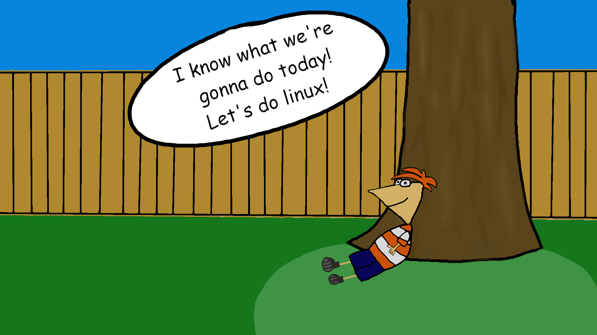

# Yuko's List Of Linux Things

### Hi Yuko! I hope you're having a wonderful christmas! I know you like Phineas and Ferb so i drew you a little picture to go along with it, I'm not really an artist but I did my best. I also heard you like messing with linux, so I made a little list of some fun distros and softwares that I've collected over the years. Hope you like it!

## [Cheat](https://github.com/cheat/cheat)

cheat allows you to create and view interactive cheatsheets on the command-line. It was designed to help remind *nix system administrators of options for commands that they use frequently, but not frequently enough to remember.

It's a command line tool and I use it all the time. I really recommend it for those niche things that you might not always think about but find yourself coming back to.

## [ncdu](https://dev.yorhel.nl/ncdu)

NCurses Disk Usage allows you to run a system in the command line that ranks all your files and folders by the amount of memory they take up. It gives a visual way to see what is actually hogging all of your memory and a nice view on knowing what to delete first.

## [czkawka](https://github.com/qarmin/czkawka)

An image duplicate sorter and remover. Allows you to easily cleanup all of your meme and rare pepe folders. 
[this youtube video](https://www.youtube.com/watch?v=CWlRiTD4vDc) is really helpful in showing how it works and it's only gotten better since.

# Coding Stuff

### Usually when someone likes to mess with linux, they also like to code, so I'm going to add in some of my own fun coding things to look at and try out as well. Some of these are quality of life improvements, some of these are just for fun.

## [DreamBerd](https://github.com/TodePond/DreamBerd---e-acc) (Fun)

DreamBerd is a stupid dumb programmin language that I actually find really funny. At the moment it is very new, so there is no compiler for it, but I might be working on something for that in the near future. Either way it's a good read wether  you actually use it or not.

## [Doxygen](https://www.doxygen.nl/) (Useful)

I use Doxygen to make almost all of my api documentation and system stuff. It is a set of rules that you follow to comment on each function and variable you want, as well as giving descriptions. It makes really nice code to read through when you follow the schema and at the end you can run Doxygen to create a webserver full of the documentation necessary to use your code! It's really useful, there's an extension to vscode that makes it native, and it just works. You'd be amazed the amount of codebases that use doxygen after you first learn about it.

## [Gitlens](https://www.gitkraken.com/gitlens) (useful, costs $$)

Gitlens is a useful software that I use almost every day to look at and sort through repositories that I am working on. It is a really helpful visual inspector as well as a useful tool for managing and editing repositories in the big picture.

## [OpenSCAD](https://openscad.org/) (useful?)

Have you ever wanted to 3D model something but 3d modeling would be too difficult to learn? Well in comes OpenSCAD, a 3d modeling software that uses all programming of shapes and translations to do it's work. As dumb as it sounds I've found it really useful to make Dynamic designs that any normal person can understand and edit once I give it to them.

## [Write your own Linux Drivers!](http://freesoftwaremagazine.com/articles/drivers_linux/) (useful)

I find I often am writing my own linux drivers to mess with certain aspects of my system and get the most out of the code I'm writing. I think it sounds intimidating to a lot of people but honestly it's not that difficult and not that scary when you get into it. I think you might like messing around with something like this.

[Useful linux driver link (makelinux)](https://www.makelinux.net/ldd3/chp-9-sect-4.shtml)
[Another useful linux driver link (Oreilly)](http://oreilly.com/catalog/linuxdrive3/book/ch03.pdf)

## [Remote Explorer](https://marketplace.visualstudio.com/items?itemName=ms-vscode.remote-explorer) (useful)

Remote Explorer is a visual studio code extension that allows you to code and look through remote servers. It makes ssh to do code 1,000,000X easier and I would never go back to the old way unless I had to. I would really recommend having it if you ever code on one machine through another.

## [valgrind](https://valgrind.org/) (useful)

valgrind is a profiling tool for your code, it allows you to follow along and see where you leak memory and other issues that may come up.

## [perf](https://perf.wiki.kernel.org/index.php/Main_Page) (useful)

This is probably already installed in your machine, it allows you to profile performance of your code and see what functions are using the most compute time. Really useful when looking to speed up code or make it more functional for end users.